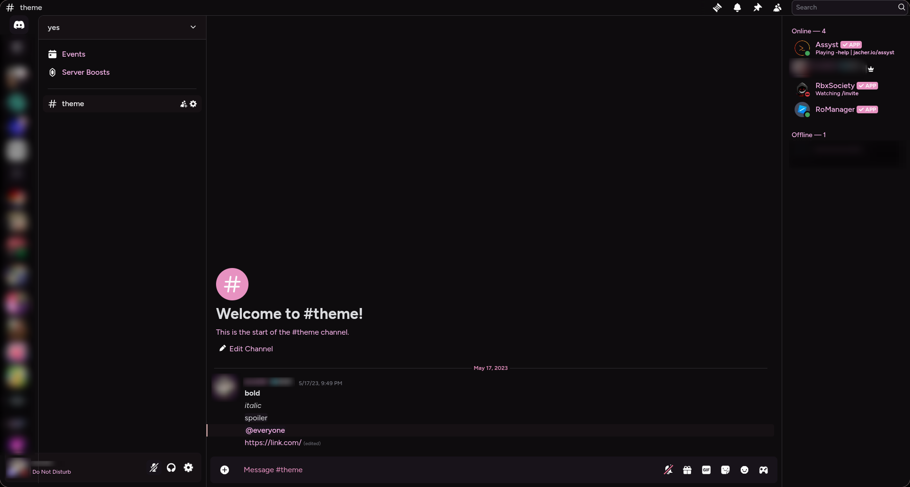
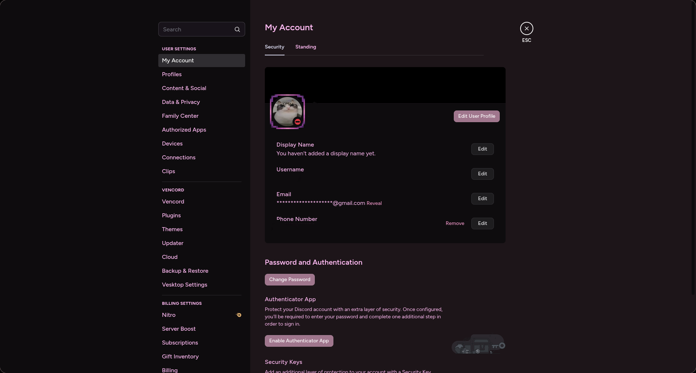

<h1 align="center">🌸 Mauve</h1>

  

  

# 🔧 Install

## Vencord/Betterdiscord (or any client that supports theme files)

1. download the theme file, MauveDesktop.css
2. drag the file into your theme folder. (there should be a button to open the theme folder in theme settings)
3. (optional) customize the theme by editing the options in MauveDesktop.css.

## Install through link

Add `https://raw.githubusercontent.com/axxelet/Mauve/refs/heads/main/MauveDesktop.css` to your theme import links.
